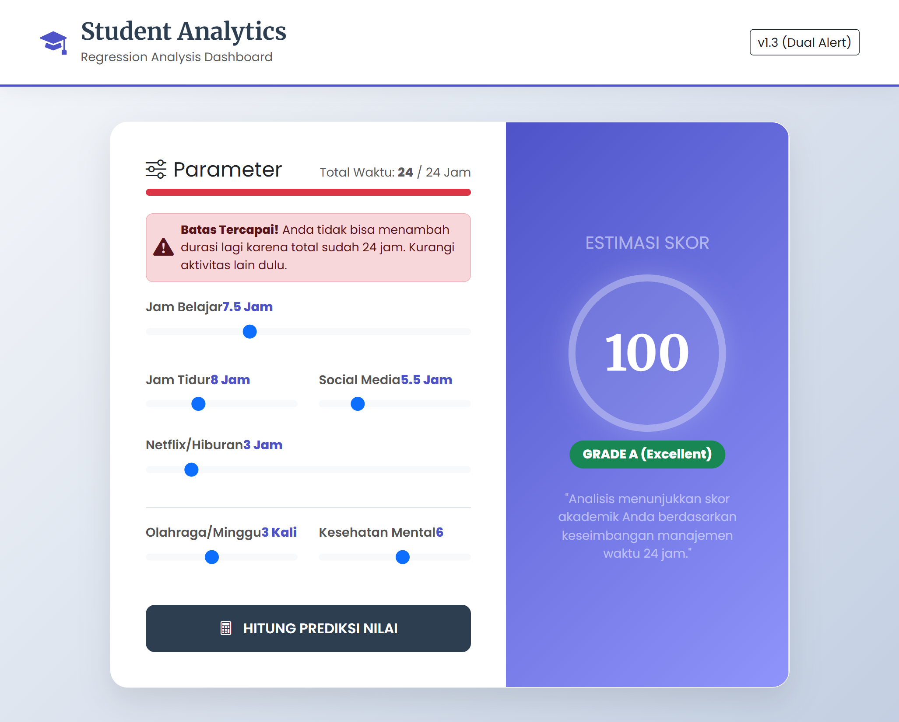

# 🎓 Analisis Regresi Performa Akademik Mahasiswa


Proyek ini bertujuan untuk memprediksi **Nilai Ujian (Exam Score)** mahasiswa berdasarkan pola gaya hidup mereka sehari-hari.
Menggunakan pendekatan **Multiple Linear Regression**, sistem ini menganalisis pengaruh variabel seperti jam belajar, durasi tidur, penggunaan media sosial, hingga kesehatan mental untuk memberikan estimasi performa akademik yang akurat.

---

## 📸 Tampilan Dashboard

> *Aplikasi web interaktif dilengkapi dengan logika pembatasan waktu 24 jam untuk input yang realistis.*




---

## 🚀 Fitur Utama

* **Analisis EDA Komprehensif**: Melakukan pembersihan data, standarisasi, dan visualisasi korelasi (Scatter Plot & Heatmap) untuk memahami pola data.
* **Seleksi Fitur Bertingkat**: Menguji 5 kombinasi model berbeda untuk menemukan prediktor yang paling signifikan.
* **Akurasi Tinggi**: Model final mencapai **$R^2$ Score 0,894** dengan tingkat kesalahan (MAE) yang rendah.
* **Smart Logic Interface**: Frontend menggunakan JavaScript untuk memastikan total input waktu aktivitas tidak melebihi 24 jam sehari (Hard Limit & Warning System).

---

## 🔁 Alur Kerja (Data Pipeline)

```mermaid
graph LR
    A[Raw Dataset] -->|Cleaning & Standardization| B(Exploratory Data Analysis)
    B -->|Correlation Matrix| C{Feature Selection}
    C -->|Top 6 Features| D[Multiple Linear Regression]
    D -->|Training & K-Fold| E(Evaluasi Model)
    E -->|Export .pkl| F[Flask Web App]
